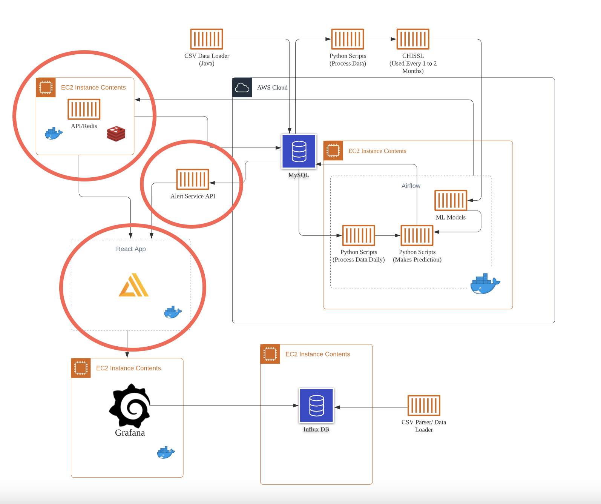

# react-app

This repo contains three components of our reac app:

- alert-service
- pnnl-frontend-react
- pnnl-predict-backend

Both _alert-service_ and _pnnl-predict-backend_ serve as the backend of _pnnl-frontend-react_.

The react-app repo contains three contains three components:

1. **alert-service**: Used to identify hunting trends that occurs in the ZoneTemperature data across various VAV devices.
2. **pnnl-predict-backend**: Used to query MySQL to provide the web app data to create visualizations (piecharts, heatmaps & stacked bar).
3. **pnnl-frontend-react**: Used to display Alerts, Predictions, and provides a link to the Grafana Dashboards.

## Quick launch?

EZ! Make sure the docker app is up and running on your machine. Then `cd ./react-app` and `docker-compose up -d` (running a set of containers at background)

---

# pnnl-frontend-react

## Summary

On the top of the main page has three links: Home, Alert, and Grafana.
The Grafana link will redirect users to Grafana channel which is mentioned above.
The Home link will redirect users to visualization components which is also default when users open the application.
The Alerts link will redirect users to the hunting service page.

### Visualization Components

There are three visualization components: pie chart, stacked bar, and heat map.They are using the same datasource. Users can use the dropdown menu to switch components. All of the labels are dynamic.
Datasource
All of the data is from a Redis URL.

### Pie Chart

The pie chart shows the data from the last 4 weeks(start from Sunday). The airflow and the temperature are two separated channels. If the data is missing or -1(invalid data), the pie chart for that day will show “No Data”.

### Stacked Bar

The stacked bar shows the data from the latest week. The airflow and the temperature are two separated channels. If the data is missing or -1(invalid data), there will be no bar on that day.

### Heat Map

The heat map shows the data from the last 4 weeks(start from Sunday). The airflow and the temperature are two separated channels. The label with highest frequency is presented each day.
Alerts(Hunting Service)

### Alerts

The page presents the device, timestamp of the hunting alerts. Users can use### the button at the top left to filter.
Datasource
All of the data is from a URL.

### Details

By clicking the DETAILS button on each row, users can get the detail of the abnormal moments.

### Run React App

`npm start` to run the app in the development mode.\
Open [http://localhost:3000](http://localhost:3000) to view it in the browser.

The page will reload if you make edits.\
You will also see any lint errors in the console.

## Learn More

You can learn more in the [Create React App documentation](https://facebook.github.io/create-react-app/docs/getting-started).

To learn React, check out the [React documentation](https://reactjs.org/).

---

# pnnl-predict-backend

Docker Images:

**cron**: Read data from mysql to redis every 3 hours

**nodejs**: Http server that serve GET requests at port 5000

**redis**: Just redis :)

This service fetches the data from a local redis data-store supposed to be updated daily. The purpose of this service is to increase the responsiveness of our frontend.

Sample requests (data available from the passed one month to present day):

GET `http://localhost:5000/range/temperature/2021-03-16/2021-03-17`

GET `http://localhost:5000/day/temperature/2021-03-16`

---

# IMPORTANT: MySQL data source specification location

You may need to configure db credentials in the following places

1. pnnl-predict-backend: `./pnnl-predict-backend/cron/credentials.yaml`
2. pnnl-frontend-react: `./pnnl-frontend-react/src/config.js`
3. alert-service: `./alert-service/Dockerfile`

# IMPORTANT: Grafana Link specification

You may need to configure grafana url inside the following file

grafana-link: `./pnnl-frontend-react/src/App.js`
